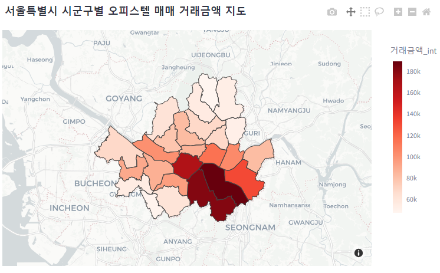

# realestate_detective1
한국의 부동산가격을 추적합니다.

## 만들게 된 동기
- 내가 알아보고 싶은 동네의 부동산 종류를 고르면 실거래가를 기준으로 그 지역의 부동산 시세를 조회할 수 있는 기능을 구현하여 부동산 알아볼 때 참고가 되길 바라는 마음으로 만들었습니다. 

## 실거래 데이터
한국 국토교통부는 부동산 실거래가를 투명하게 공개하고 있습니다.
https://rt.molit.go.kr/pt/xls/xls.do?mobileAt=
raw data는 모두 여기서 조회하여 가져왔습니다. 

#1 raw data정제, 결합
raw data는 가장크게 아파트, 연립/다세대, 단독/다가구 등 거래유형별로 모읍니다. (연도별로 받은 것을 거래유형별로 모으기)

#2 시세조회
먼저 아파트, 연립/다세대, 단독/다가구, 오피스텔별로 최근 5개년 rawdata를 기반으로 사용자가 지정한 기간동안 시세를 조회할 수 있는 표 
(기간, 집크기, 거래유형별로 필터 적용)

*계획
#3 거래지도
거래량이 많은 지역을 더 눈에띄게 표시하는 것 구현

예) 

#*진행상황(3월 15일) + feedback
- 먼저 서울 5개년 아파트데이터 불러와서 연도, 시군구, 전용면적 3가지 필터를 적용하여 그래프를 보여주는 기능까지 완료.
- 기 작성한 코드를 토대로 다른 데이터들도 똑같이 확장하면 됨.(rawdata_process에는 엑셀 rawdata 정제)
- 엑셀 pandas 사용시에는 모든 열의 수를 같게 해줘야한다. 
- 디버그 콘솔 너무좋다. 더 적극적으로 활용하자.
- 거래가 있었던 시점에 점을 찍고 그다음 선을 이어서 해당 시점에 거래가 있었다는 것을 표현하는 것으로 그래프 그림.

#*진행상황(3월 16일) + feedback
- 아파트 먼저 진행, raw data를 서울과 경기 5개년으로 확장. 
- 매매만 있었는데 전월세도 포함해서 보여줌. 
- 전세 선택한 경우엔 보증금만, 월세 선택하면 보증금과 월세 그래프 2개 그려줌. 
- raw data 가져올 때, CP949로 인코딩 중요. DATA 열 하나가 엑셀에서 "통화"로 설정되어 있어서 오류있었음 > 일반으로 수정
- 코드가 점점 길어지니까 확실히 얘들을 분리해서 표현해줄 필요성이 생김. (깔끔하게!)
- 속도가 좀 느림 속도를 빠르게 할 수 있는 방법을 구해야함. 
- 향후 연립/다세대, 단독/다가구, 오피스텔 끝내고 (매매와 전월세 둘다 있음)
- 분양/입주권, 상업/사무용, 토지, 공장/창고까지.(매매만 있음)
